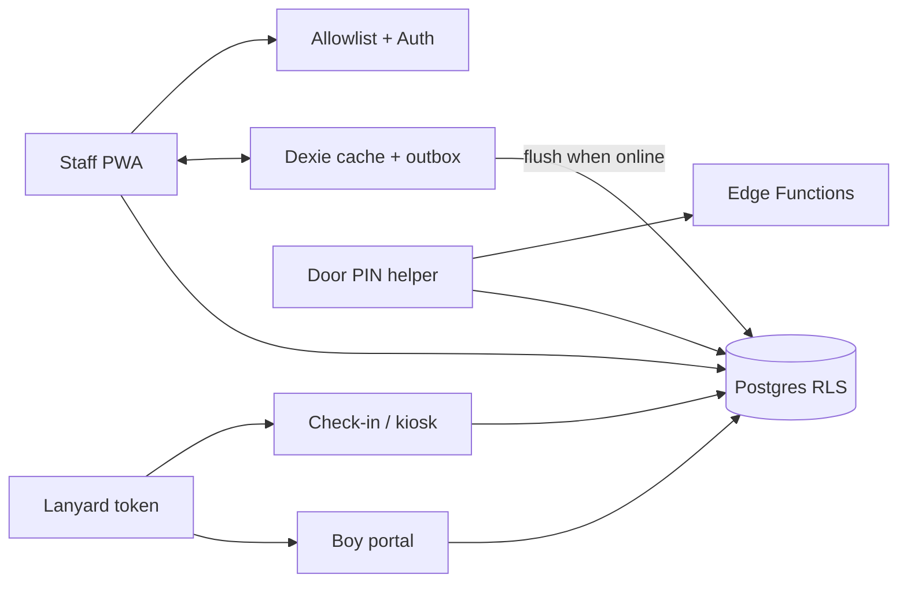

# B.A.R.T. — Boys Are Readers Too

Offline-first staff PWA for youth literacy nights. Allowlisted staff check boys in by lanyard QR (or search) even when venue Wi‑Fi drops, log reading and quizzes, track a reward economy, and keep youth personal data behind role-scoped access — boys never get a staff account.

> **Source available, not open source.** This repository contains the front-end application only and is published for viewing. The database schema, access policies, edge functions, and operational tooling are not included. See [LICENSE](LICENSE).

## Architecture

**Offline-first staff client.** React + Vite talks to Supabase, but night-of work does not depend on a clean connection: Dexie caches roster and sessions and queues mutations in an outbox (`src/lib/db.ts`, `src/lib/sync.ts`) that replays idempotently when the connection returns. The PWA service worker is production-build only (`vite-plugin-pwa`).

**Youth-safety access model.** Staff signup is invite-only. Postgres row-level security distinguishes admin, volunteer, and door roles. Door helpers redeem a nightly PIN and reach only check-in, check-out, and the live roster. Boys and kiosk flows identify a child by a lanyard token rather than a login, so there is no account or password for any child.



## Features

- Door check-in and check-out with e-signature and authorized-pickup enforcement
- Live roster, lanyard printing, and per-boy required-forms tracking
- Session calendar with hover previews for admins
- Reading logs, true/false comprehension quizzes, and a phone-friendly boy portal
- BART Bucks reward ledger and ranks
- Reports with CSV export, broadcast messaging, and a view-only family page
- Works offline on tablets at the door; syncs when Wi‑Fi returns

## Stack

React 19 · TypeScript · Vite 6 · Tailwind 4 · Dexie · Supabase (Auth, Postgres RLS, Edge Functions) · Vercel · GitHub Actions

## What matters in the code

- **Offline-first:** roster/session prime → local cache → queued check-in/out writes → manual or automatic flush (`src/lib/sync.ts`)
- **Role-based access:** door-limited routes in `ProtectedRoute`, role-aware navigation and pages
- **Token identity for kids:** lanyard tokens for door, kiosk, and the boy portal; no youth passwords
- **Least data per screen:** explicit column selects in `src/lib/participantColumns.ts`; the boy portal never receives surnames
- **Shared-device hygiene:** pickup details are cached in a separate local table and wiped on sign-out

## Layout

```
src/pages/        check-in, roster, kiosk, boy portal, curriculum, reports, …
src/components/   door, roster, sessions calendar, lanyards, brand
src/lib/          sync/outbox, check-in, portal, column selects, dates
src/hooks/        data hooks over the offline cache
```

---

Designed by David Kimbro. Patent pending. © 2026 All rights reserved.
